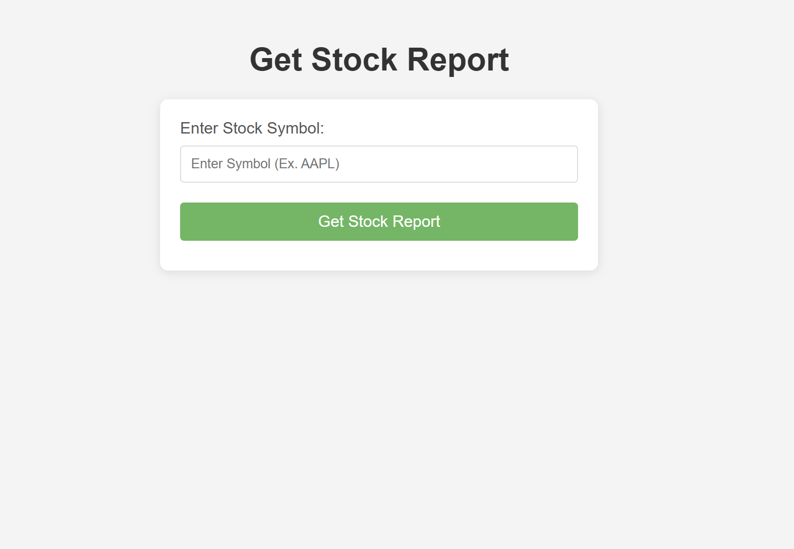

# StockReport.io

## This app is designed to provide high level stock anaylisis in seconds 

>I myself an active participant within the stock market and I find not enough resources give enough information, news, sentiments,
as its all behind pay walls.

>This is free and provides more than enough data on Company Earnings, Sentiment, Quote, Overview, and a fun extra bit of info on the biggest active winners and losers in the market.

## The app is easy to use!
>All you must do is enter a stock symbol of your choice, wait for the documents to compose and within 5 seconds you have a deep level analysis of that stock!

# Interested?
### Find the completed product here: [StockReport.io](https://stockreport.jginc.org)

*NOTE: THE API CALLS ARE LIMITED*

